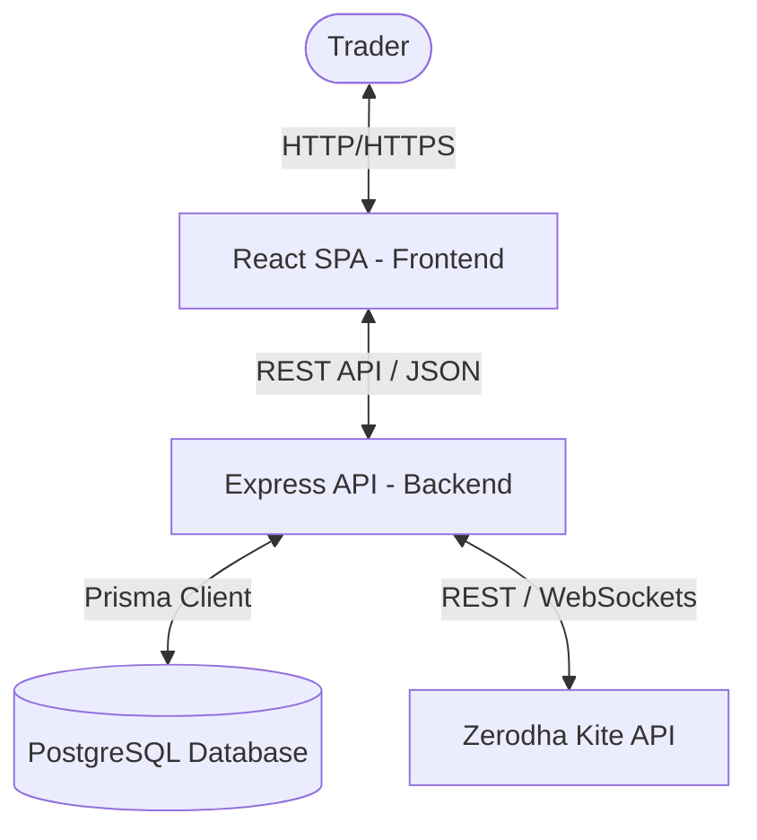

# Architecture Design

This document details the system design, tech stack overview, and architectural components of TradingLab.

## Tech Stack Overview

TradingLab is built as a production-grade TypeScript monorepo using `pnpm` workspaces.

### Frontend

- **UI Layer**: React 19, TypeScript, Tailwind CSS, shadcn/ui tokens.
- **Routing**: TanStack Router (Typesafe, code-based layout routing).
- **State Management**:
  - **Global UI State**: Zustand (light/dark mode toggle, auth context).
  - **Server Cache**: TanStack Query (managing positions, holdings, margins, journal entries).

### Backend

- **API Framework**: Express, TypeScript, Node.js.
- **Database Access**: Prisma ORM, PostgreSQL database.
- **External Integration**: Kite Connect Node SDK (Zerodha).
- **Logger**: Winston (structured logs with sensitive data scrubbing).

---

## System Context Diagram

---

## Key Design Patterns

1. **Monorepo Separation of Concerns**:
   - Shared schemas, types, and Zod validators live in `packages/shared`.
   - Layout systems and basic buttons live in `packages/ui`.
   - Configurations for TypeScript, ESLint, and Prettier are exported from `packages/config`.

2. **Graceful Shutdown & Fault Tolerance**:
   - The Express backend hooks into `SIGINT`/`SIGTERM` to safely terminate active HTTP links and disconnect the Prisma connection pool, avoiding database connection leaks.

3. **Secure Environment Control**:
   - Zod validators (`config/env.ts`) process environments at bootstrap, sanitizing details and immediately stopping the process if crucial keys are missing.
   - Loggers feature recursive key-masking logic to prevent keys (like JWT secret and Kite credentials) from leaking into files or logs.
