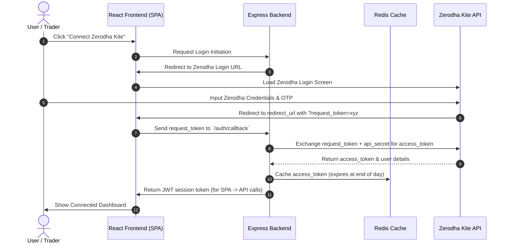

# Trading Integration & Authentication Flow

This document details the authentication and data flow for the Zerodha Kite Connect integration.

## Kite Connect OAuth Authentication Sequence

---

## Token Cache & Session Strategy

1. **Access Token Lifespan**:
   - Zerodha Kite Connect access tokens expire daily (around 6:00 AM IST).
   - A new login token must be fetched at the beginning of each trading day.

2. **Session Storage**:
   - Active sessions are saved securely.
   - Redis stores the active `access_token` mapped to the user session, avoiding roundtrips to Zerodha for every API call.
   - Client-side auth is maintained using a secure JWT cookie or HTTP header.
